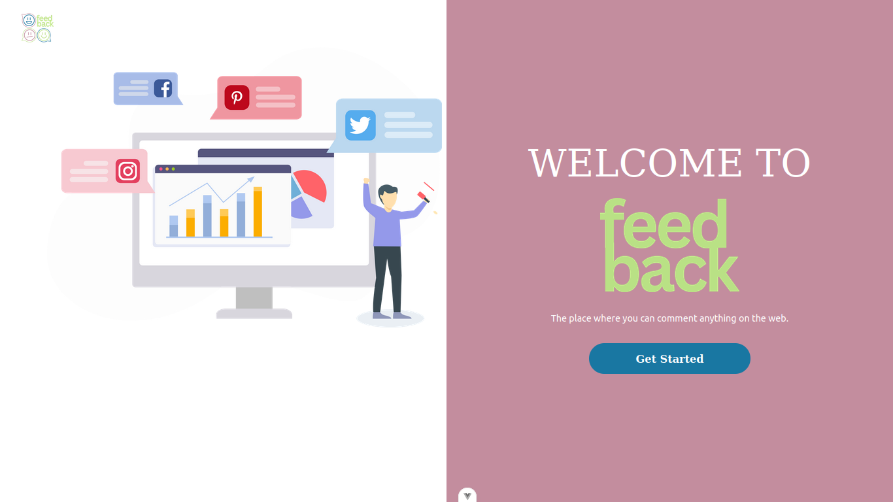
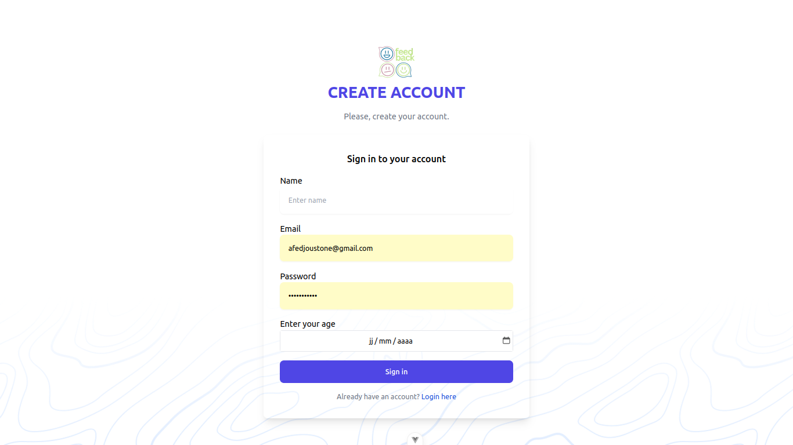
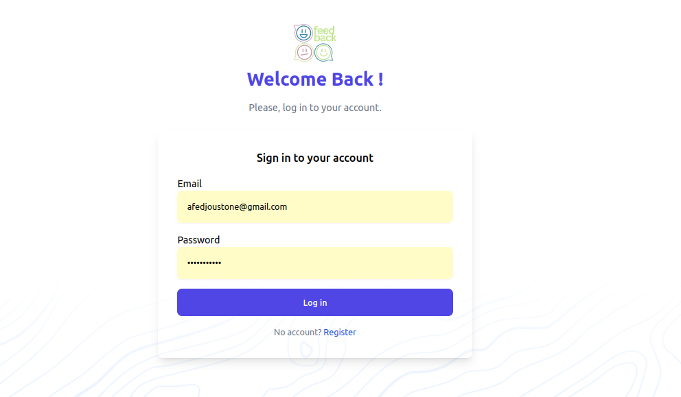
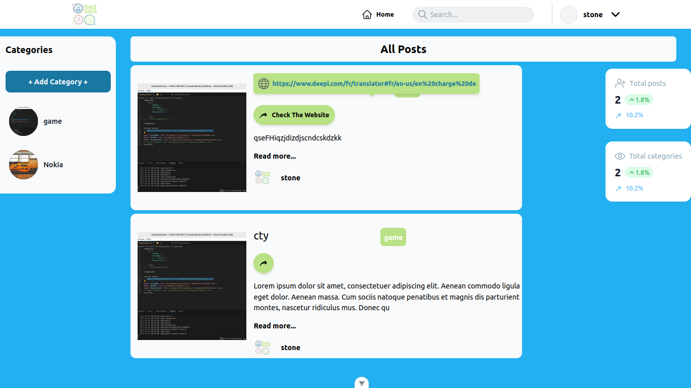
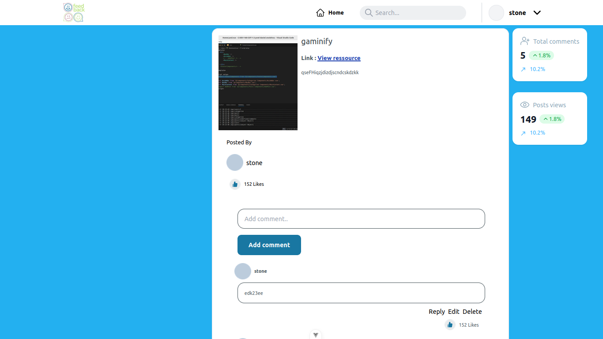
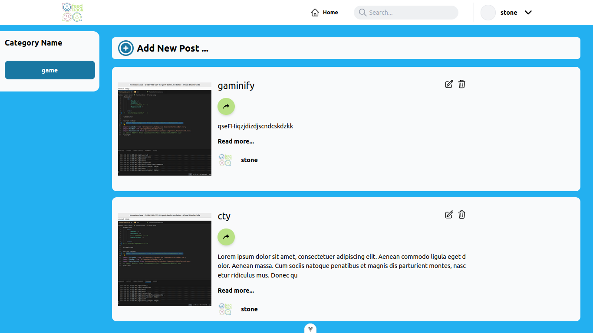
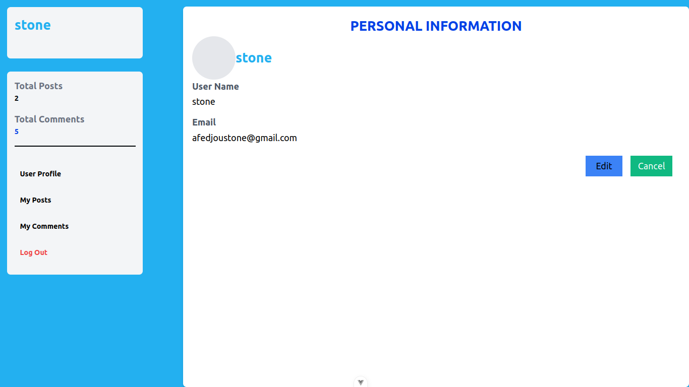
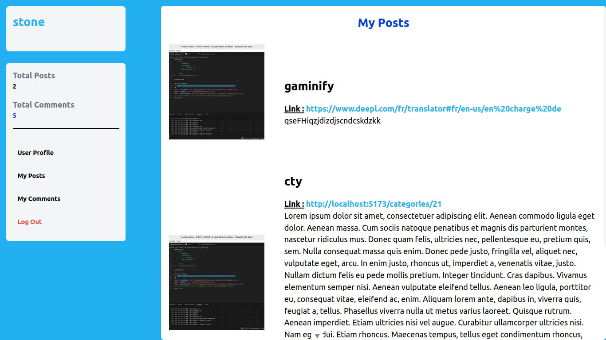
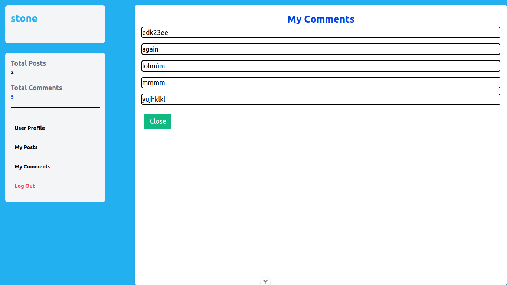
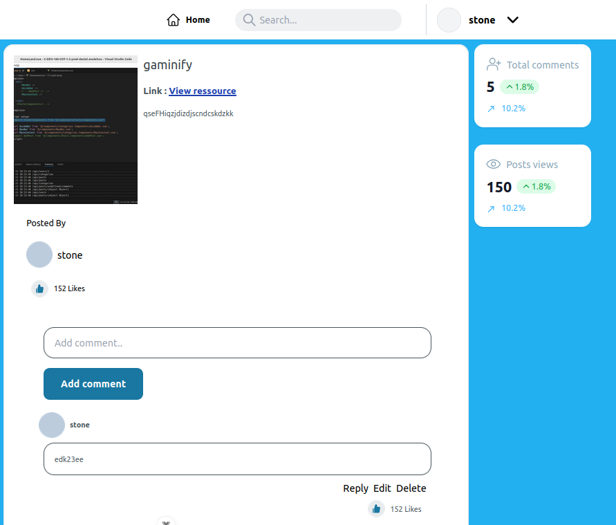

# YOWL
Yowl is an application that lets you comment on everything on the Internet

# Introduction 
This project involves the creation of an application enabling everyone to give their opinion on internet posts.

# Getting Started

##  REQUIRES
-  Vuejs
-  Nodesjs
-  Tailwind css
-  composer
-  php last version
-  laravel
-  docker
-  mysql
 

## INSTALLATION

-   Clone the contents to working web directory using git clone "reposistory".
-   Make npm install,npm run dev in the Frontend file
-   Make composer install in the Backend file
-   Configure .env file and run php artisan migrate
-   Make php artisan serve
 

# Usage

- Check that tailwind is installed in the project
- Check that composer and laravel are installed 
- Check that components are imported correctly

# Authors
1. This project was carried out by Daniel MEDEHOU project manager responsible for

   - Post and category crud api management
   - Oragnisation and cordination of the team and Merging

   - Github : [Daniel MEDEHOU](https://github.com/Brandon22030)
   - Email : daniel.medehou@epitech.eu

2. Romeo GOSSOU-BAH in charge of user crud and user profile management

   * Github : [Romeo GOSSOU-BAH](https://github.com/Romeo2520)
   * Email : romeo.gossou-bah@epitech.eu

3.  Stone AFEDJOU in charge of comment crud management and post display, kpi management

   * Github : [Stone AFEDJOU](https://github.com/stonefadel02)
   * Email : stone.afedjou@epitech.eu

4.  Farid ADOI in charge of managing likes and posts 

   * Github : [Farid ADOI](https://github.com/Fqr1d0)
   * Email : farid.adoi@epitech.eu

 

# License

- This project is owned by Daniel MEDEHOU, Romeo GOSSOU-BAH,Stone AFEDJOU and Farid ADOI
- The project is open source but can't be used for illegal purposes.
